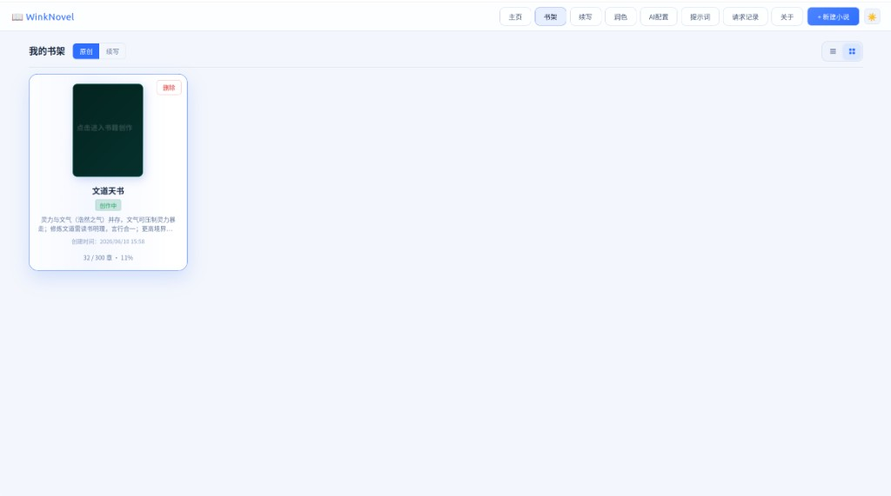
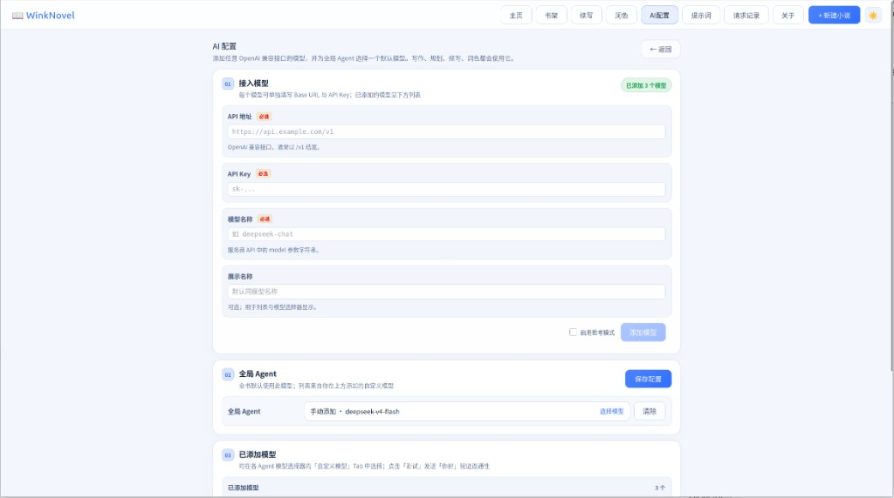
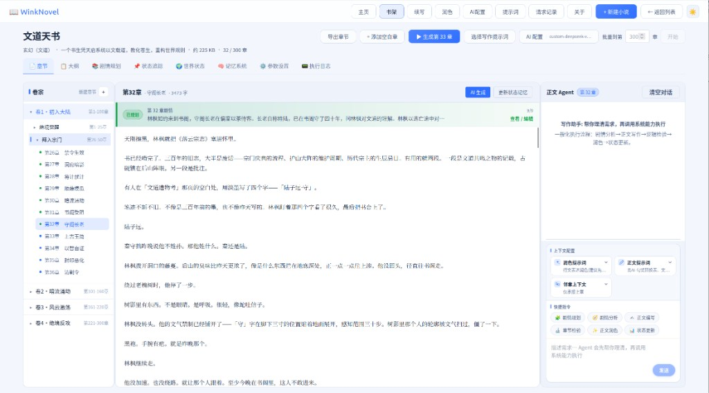

# WinkNovel

本地优先的 AI 长篇网文创作工作台：问卷立项、大纲规划、按章写作、逻辑审稿与世界状态维护均可在浏览器中完成。

[](./LICENSE)
[](https://www.python.org/)
[](https://nodejs.org/)
[](https://github.com/winkxiaoxing/WinkNovel)

- **仓库地址：** [https://github.com/winkxiaoxing/WinkNovel](https://github.com/winkxiaoxing/WinkNovel)
- **开源协议：** [MIT](./LICENSE)
- **技术栈：** Python + FastAPI · React + Vite
- **可运行安装包下载：** [夸克网盘](https://pan.quark.cn/s/b80a053be1dd)

本开源版本仅支持 **自定义 OpenAI 兼容 API**（DeepSeek、OpenAI、本地 Ollama 等）。不绑定商业套餐，不内置第三方网关地址。数据默认保存在本机。

> **⭐ 欢迎 Star [抱拳][抱拳][抱拳]**  
>
> 如果 WinkNovel 对你有帮助，请到 GitHub 仓库右上角点亮 **Star**，这是对开源维护最直接的支持：  
>
> **[→ 点击前往仓库并 Star](https://github.com/winkxiaoxing/WinkNovel)**

---

## 目录

- [功能概览](#功能概览)
- [安装包下载](#安装包下载)
- [界面预览](#界面预览)
- [环境要求](#环境要求)
- [快速开始（Anaconda）](#快速开始anaconda)
- [启动服务](#启动服务)
- [配置 AI](#配置-ai)
- [自检清单](#自检清单)
- [目录结构](#目录结构)
- [常见问题](#常见问题)
- [参与贡献](#参与贡献)
- [开源协议](#开源协议)

---

## 功能概览

顶部导航：主页、书架、续写、润色、**AI 配置**、提示词、请求记录、**关于**。  
模型在「AI 配置」中添加，并为 **全局 Agent** 指定默认模型。

---

## 安装包下载

**若不希望从源码自行编译，可直接下载安装包使用**：

| 平台 | 说明 | 下载地址 |
|------|------|----------|
| Windows | 安装包 / 可执行程序 | [夸克网盘](https://pan.quark.cn/s/b80a053be1dd) |
| Mac | 安装包 / 可执行程序 | [夸克网盘](https://pan.quark.cn/s/b80a053be1dd)  |
| **使用说明** | 安装使用教程 | [夸克网盘](https://pan.quark.cn/s/b80a053be1dd)  |
|||

> 网盘文件可能随版本更新；请下载最新发布包，并按包内说明安装。若链接失效，请到 [GitHub Issues](https://github.com/winkxiaoxing/WinkNovel/issues) 反馈。

---

## 界面预览

### 我的书架

作品列表与进度一览，支持原创 / 续写分栏。



### AI 配置

接入任意 OpenAI 兼容模型，并为全局 Agent 选择默认模型。



### 写作工作台

章节导航、正文编辑与正文 Agent 同屏协作。



---

## 开发者环境要求

| 依赖 | 版本建议 |
|------|----------|
| Anaconda / Miniconda | 建议已安装（下文用 `conda`） |
| Python | ≥ 3.10（由 conda 环境提供） |
| Node.js | ≥ 18（含 npm） |
| 网络 | 可访问你所选的 LLM API |

支持操作系统：Linux / macOS / Windows。

请先确认本机可用：

```bash
conda --version
node --version
npm --version
```

若尚未安装 Anaconda / Miniconda，请先到官网安装后再继续：

- Anaconda：https://www.anaconda.com/download  
- Miniconda：https://docs.conda.io/en/latest/miniconda.html  

---

## 快速开始（Anaconda）

> 以下命令均假设当前目录为**包含** `backend/`、`frontend/`、`config/` 的项目根目录。  
> 若 `git clone` 后目录层级不同，请先 `cd` 到该层再执行。

### 1. 克隆仓库

```bash
git clone https://github.com/winkxiaoxing/WinkNovel.git
cd WinkNovel
```

### 2. 创建并激活 Conda 环境

```bash
# 创建名为 winknovel 的 Python 3.11 环境（可按需改成 3.10 / 3.12）
conda create -n winknovel python=3.11 -y

# 激活环境
conda activate winknovel

# 确认当前环境
python --version
which python   # Windows 可用：where python
```

之后所有后端相关命令，请在 **已激活** `winknovel` 的终端中执行。

### 3. 安装 Python 依赖

```bash
# 建议先升级 pip
python -m pip install --upgrade pip

# 安装项目依赖
pip install -r requirements.txt
```

### 4. 生成本地配置（无密钥模板）

从示例配置复制出可写配置（已存在则不要覆盖，以免冲掉本地密钥）：

```bash
# Linux / macOS
cp -n config/generation_config.example.json config/generation_config.json
cp -n config/custom_gateway_models.example.json config/custom_gateway_models.json

# Windows（若目标文件已存在请跳过）
# copy config\generation_config.example.json config\generation_config.json
# copy config\custom_gateway_models.example.json config\custom_gateway_models.json
```

### 5. 安装前端依赖

```bash
cd frontend
npm install
cd ..
```

---

## 启动服务

需要同时运行 **两个进程**：后端 API（默认 `8000`）+ 前端开发服务器（默认 `5173`）。

### 启动后端

在项目根目录，并已 `conda activate winknovel`：

```bash
export PYTHONPATH="$(pwd):${PYTHONPATH}"   # Windows 可跳过，或手动把项目根加入 PYTHONPATH
python -m uvicorn backend.main:app --host 127.0.0.1 --port 8000 --reload
```

也可使用脚本（监听 `0.0.0.0:8000`；同样请先激活 conda 环境）：

```bash
chmod +x ./start_backend.sh
./start_backend.sh
```

验证后端：浏览器打开 [http://127.0.0.1:8000/docs](http://127.0.0.1:8000/docs)，应能看到 FastAPI 文档页。

### 启动前端

新开一个终端（前端不依赖 conda，但也可在任意终端执行）：

```bash
cd frontend
npm run dev
```

开发模式下前端默认请求 `http://localhost:8000/api`。  
浏览器打开终端提示的地址（一般为 [http://127.0.0.1:5173](http://127.0.0.1:5173)）。

### （可选）生产式：前端构建后由后端托管

```bash
conda activate winknovel
cd frontend
npm run build
cd ..

export PYTHONPATH="$(pwd):${PYTHONPATH}"
python -m uvicorn backend.main:app --host 127.0.0.1 --port 8000
```

构建产物位于 `frontend/dist/`。仅启动后端后访问 [http://127.0.0.1:8000](http://127.0.0.1:8000) 即可。

---

## 配置 AI

1. 打开顶部 **「AI 配置」**
2. 填写 OpenAI 兼容的 **Base URL**（通常以 `/v1` 结尾）、**API Key**、**模型名**
3. 点击添加模型，建议先执行连接测试
4. 在 **全局 Agent** 中选择模型并保存

常见 Base URL 示例（以各服务商文档为准）：

| 服务商 | Base URL 示例 |
|---------|------------------|
| DeepSeek | `https://api.deepseek.com/v1` |
| OpenAI | `https://api.openai.com/v1` |
| Ollama（本地） | `http://127.0.0.1:11434/v1` |

**安全提示**

- API Key 仅保存在本机（如 `config/generation_config.json`、`config/custom_gateway_models.json`）
- 请使用仓库中的 `*.example.json` 作为模板
- **勿将含真实密钥的配置或 `work_space/` 书稿提交到 Git**

---

## 自检清单

完成安装与 AI 配置后，建议按下列清单自检：

- [ ] `http://127.0.0.1:8000/docs` 可打开
- [ ] 前端页面可打开，且顶部导航正常
- [ ] 「AI 配置」可添加模型并为全局 Agent 保存
- [ ] 「书架」可新建小说或进入已有作品（首次使用后会出现 `work_space/`）
- [ ] 生成第 1 章时，「执行日志」或「请求记录」有对应调用

推荐试用路径：

1. AI 配置 → 添加模型 → 选择全局 Agent  
2. **新建小说** → 问卷 → 生成大纲 → 建书  
3. 进入作品 → 完成剧情规划 → **章节**生成第 1 章  

续写：顶部 **续写** → 新建项目 → 导入正文 → 完成大纲 / 剧情 / 状态准备 → 创作。

---

## 目录结构

```
wink_novel/
├── backend/           # FastAPI 后端
├── frontend/          # React + Vite 前端
├── agents/            # Agent 业务逻辑
├── core/              # LLM 路由、自定义模型等
├── utils/
├── config/            # 运行配置与 *.example.json
├── user_prompt/
├── work_space/        # 本地运行时数据（默认 gitignore）
├── start_backend.sh
├── requirements.txt
├── LICENSE
└── README.md
```

同级或上级目录可能包含 `agent_prompt/`。请确保 Python 能 `import backend` / `core`，且提示词路径与代码约定一致。

---

## 常见问题

**前端打开了，但接口全部失败？**  
确认后端已在 `8000` 监听；开发模式下前端会请求 `http://localhost:8000/api`。检查浏览器 Network 与后端终端日志。

**`ModuleNotFoundError: backend` / `core`？**  
在项目根目录启动，确认已 `conda activate winknovel`，并设置 `PYTHONPATH` 为项目根（见 [启动服务](#启动服务)），或使用 `./start_backend.sh`。

**`conda: command not found`？**  
说明 Anaconda / Miniconda 未安装，或终端未初始化 conda。安装后重新打开终端，或执行 `conda init`。

**配置写不进去 / Permission denied？**  
不要把项目放在只读目录。必要时程序会回退到用户目录下的可写配置路径。

**生成失败或空正文？**  
核对 Base URL、API Key、模型名与服务商余额；查看单书「执行日志」与顶部「请求记录」。

**gitignore 是否影响他人复现？**  
不会。被忽略的是本机密钥、书稿与缓存；源码与 `*.example.json` 仍会进入仓库。

---

## 参与贡献

### 欢迎 Star

如果本项目对你有帮助，欢迎前往仓库点击 **Star**：

**[https://github.com/winkxiaoxing/WinkNovel](https://github.com/winkxiaoxing/WinkNovel)** ⭐

Star 能帮助更多作者发现 WinkNovel，也是对持续维护的鼓励。

### Issue / PR

欢迎通过 [Issues](https://github.com/winkxiaoxing/WinkNovel/issues) 与 Pull Request 反馈问题或改进。

提交前请确认：

- 不要提交含 API Key 的配置文件
- 不要提交 `work_space/` 中的作品内容
- 变更说明尽量包含复现步骤或截图

维护者：[winkxiaoxing](https://github.com/winkxiaoxing)

---

## 开源协议

[MIT](./LICENSE) © winkxiaoxing   

### 使用声明

未经开发者允许的任何商业化行为，均视为侵权。  
如需将本项目用于商业产品、付费服务、二次分发售卖或其他商业用途，请事先通过 [GitHub](https://github.com/winkxiaoxing) 联系开发者取得授权。
